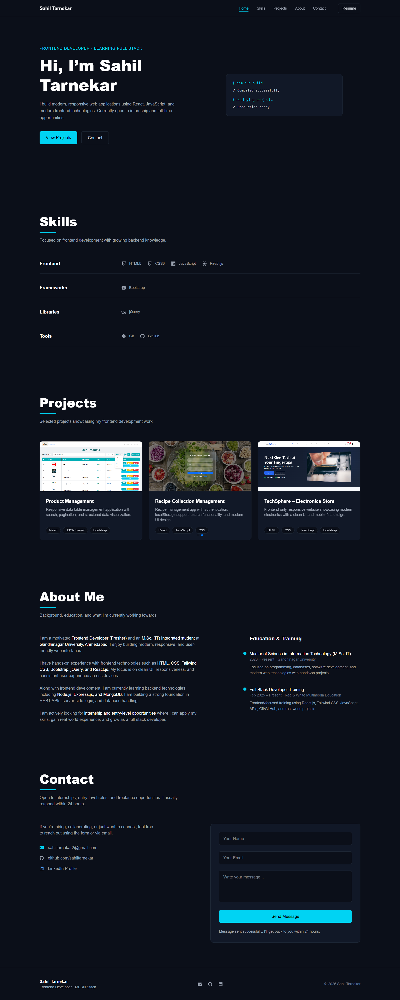

# Sahil Tarnekar – Frontend Developer

A modern, responsive portfolio website built to showcase my skills, projects, and background as a **Frontend Developer**.  
Currently open to **internship and entry-level job opportunities**.

🔗 **Live Website:**  
https://stportfolio.netlify.app/

---

## 📸 Website Preview

---

## 👨‍💻 About Me

I am a motivated **Frontend Developer (Fresher)** and an **M.Sc. (IT) Integrated student** at Gandhinagar University, Ahmedabad.  
I enjoy building clean, responsive, and user-friendly web interfaces.

Along with frontend development, I am currently learning backend technologies such as **Node.js, Express.js, and MongoDB**, and building a strong foundation in REST APIs and server-side logic.

---

## 🛠️ Skills & Technologies

- **Frontend:** HTML5, CSS3, Tailwind CSS, Bootstrap, JavaScript, React.js  
- **Tools:** Git, GitHub  
- **Backend (Learning):** Node.js, Express.js, MongoDB  

---

## 📂 Projects

The portfolio includes multiple frontend projects such as:
- Real estate web applications
- Data table management apps
- Recipe management systems
- Responsive e-commerce UI websites

Each project includes:
- Live demo links  
- Tech stack used  
- Clean and responsive UI  

---

## 📬 Contact

I am actively looking for **internship and entry-level opportunities**.

You can reach me via:
- **Email:** sahiltarnekar2@gmail.com  
- **GitHub:** https://github.com/sahiltarnekar  
- **LinkedIn:** https://www.linkedin.com/in/sahil-tarnekar-0b2413307/

The contact form on the website is fully functional using **EmailJS**, with automatic confirmation replies.

---

## 🚀 Features

- Fully responsive design  
- Modern dark UI  
- Smooth animations with Framer Motion  
- EmailJS-powered contact form  
- Clean and consistent layout  

---

## 📌 Note

This portfolio is continuously evolving as I learn and build more real-world projects.

Thank you for visiting! 🙂
